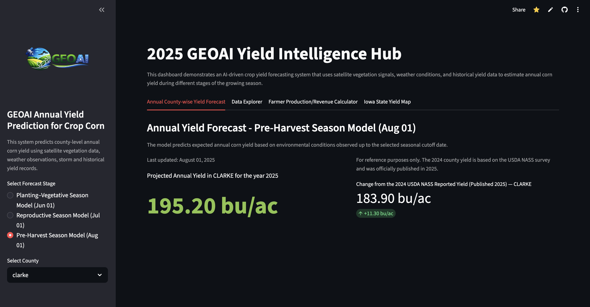

# GEOAI Corn Annual Yield prediction
APPLICATION:

🔗 [Open Live App](https://jinjose-geoai-msds-feb22finalexperimentsstreamlita-j20gmx.streamlit.app/)

### Important  instructions
 ``` Download this shape file from internet tl_2023_us_county.shp``` and place it under raw_dataprep

```mlflow ui --port 5050 --backend-store-uri "./Feb22 Final Experiments/mlruns"```

```python dataprep/weather_era5.py --mode live, historical ```

```python dataprep/ndvi_croplevel.py --mode live, historical```

```python src/build_new_features.py --mode live, historical ``` 

``` pytest --html=report.html --self-contained-html -o log_cli=true --log-cli-level=INFO``` 
## Project Structure

```
 Feb22 Final Experiments/ 
├── exported_models/        # Final selected models per cutoff
├── plots/                  # Auto-generated comparison plots
├── raw_dataprep/           # Raw preprocessing outputs
├── src/
│   ├── analysis/           # Plotting, SHAP, comparison utilities
│   ├── features/           # Raw data cleaning, Feature engineering logic
│   ├── models/             # All model training functions
│   ├── build_new_features.py
│   ├── config.py
│   ├── training.ipynb      # Main training + model selection script
│   └── training.html       # HTML view  of training.ipynb 
|   └── inference-demo.ipynb       # Inference demo script
|   └── inference-demo.html       # HTML file of inference-demo.ipynb
│   └── utils.py
│   └── tests               # Unittest
├── training-dataset/
│   ├── features_frozen/    # Cutoff-specific frozen feature files
│   └── raw/                # Raw source data
| report.hmtl               # Pytest test outputs
Inference_Pipeline      #AWS cloud deployment resources 
```

------------------------------------------------------------------------

## Data Setup

1.  The dataset is stored in **Google Drive**.
2.  Download the data from Google Drive.
3.  Copy raw files into: training-dataset/raw/
4.  After running feature engineering, the processed datasets will be
    saved in: training-dataset/features-frozen/

------------------------------------------------------------------------

## Feature Engineering

To generate new feature sets:

``` bash
python src/build_new_features.py --mode historical, live
```

This will:

-   Read data from `data/raw/`
-   Generate NDVI and weather features
-   Save feature tables into `data/frozen/`

------------------------------------------------------------------------

## Model Training

To train models:

``` bash
python src/train.py
```

This will:

-   Load features from `data/frozen/`
-   Run walk-forward validation
-   Log metrics and artifacts to MLflow

------------------------------------------------------------------------

## Viewing Results in MLflow

Start MLflow UI:

``` bash
mlflow ui
```

If you need a different port:

``` bash
mlflow ui --port 5050
```

Then open in browser:

    http://127.0.0.1:5000

MLflow will show:

-   Model parameters
-   MAE, RMSE, MAPE, R²
-   Comparison plots
-   Artifacts and logs


Results:

